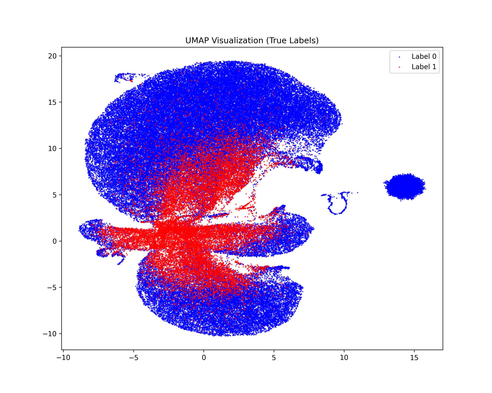
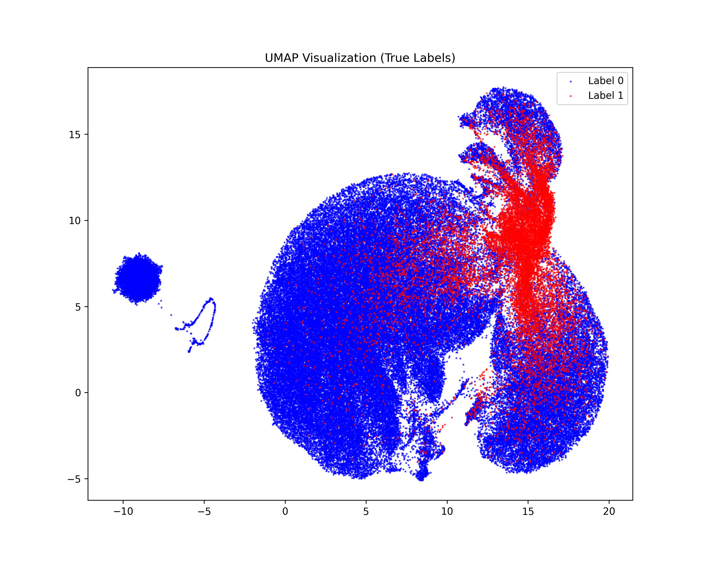
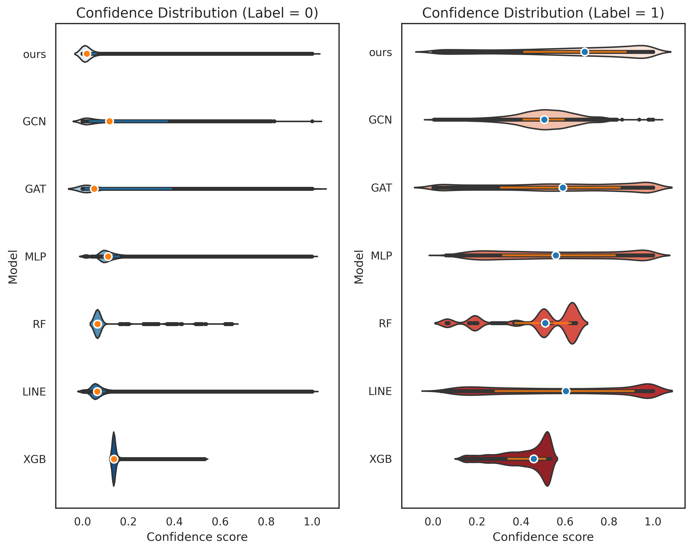

# ChromRloop

A graph contrastive learning (GCL) framework for predicting R-loop formation regions in the human genome using Hi-C contact maps and genomic features.

The model encodes each genomic bin of a chromosome as a node in a graph, where edges are defined by Hi-C contacts. A two-layer GCN encoder is pre-trained with a contrastive objective (feature reconstruction, topology reconstruction, and cross-view feature correlation under feature/topology augmentation), and the learned node embeddings are fed into a small classifier head for R-loop prediction.

## Method

1. **Graph construction.** For each chromosome, bins are treated as nodes. Edges are built from Hi-C contact pairs whose interaction value exceeds a threshold. Node features are genomic features per bin, standardized per chromosome.
2. **Contrastive pre-training.** A GCN encoder learns 12-dimensional embeddings with two augmentation views:
   - *Feature augmentation*: additive Gaussian noise on node features.
   - *Topology augmentation*: random edge dropout.
   
   The pre-training objective combines feature reconstruction loss, adjacency-matrix reconstruction (MSE, block-computed to save GPU memory), and cross-view cosine-similarity loss.
3. **Supervised classifier.** A two-layer MLP classifier (BCEWithLogitsLoss) is trained on the frozen embeddings and evaluated with **22-fold chromosome-level cross-validation**: each fold leaves one chromosome out for testing and the next one for validation, with early stopping based on validation AUPRC.

## Repository Structure

```
ChromRloop/
├── train.py                 # GCL pre-training + classifier training + 22-fold CV
├── test.py                  # Evaluation using saved checkpoints
├── visualization/
│   ├── dim_draw.py          # Per-chromosome UMAP visualization (true labels)
│   ├── dim_draw_merge.py    # All-chromosome UMAP visualization per method
│   └── draw_my_violin.py    # Confidence-score violin plots per model & label
├── figures/
│   ├── clustering/          # UMAP clustering figures (K562 & MOLM13)
│   │   ├── K562/
│   │   └── MOLM13/
│   └── violin/              # Violin plots of prediction confidence
```

## Requirements

- Python 3.8+
- PyTorch (CUDA recommended)
- PyTorch Geometric
- numpy, pandas, scikit-learn, tqdm
- matplotlib, seaborn, umap-learn

Install with:

```bash
pip install torch torch-geometric numpy pandas scikit-learn matplotlib seaborn umap-learn tqdm
```

## Data Preparation

Both scripts expect the following layout under `data/`:

```
data/
└── {CELLLINE}/{RESOLUTION}/
    ├── HiC/chr{i}_*          # Tab-separated Hi-C edges: u, v, edge_val
    ├── feats/chr{i}_features # Node features, one row per genomic bin
    └── Label/chr{i}_label.txt# Node labels (R-loop: 1 / non-R-loop: 0)
```

`CELLLINE` is one of `K562`, `MOLM13` and `RESOLUTION` is e.g. `25K` (configurable at the top of each script). Chromosomes 1–22 are used.

## Usage

### Training

```bash
python train.py
```

Set `CELLLINE`, `RESOLUTION`, `GCL_EPOCHS`, `HiC_THRESHOLD` and other hyperparameters at the top of `train.py`. Trained checkpoints are saved to `result/model/`. Per-fold test metrics are appended to `result/train_{CELLLINE}_{RESOLUTION}_Ress.txt`.

### Testing

```bash
python test.py
```

`test.py` loads the saved GCL encoder and per-fold classifiers from `result/model/` and reports metrics on each held-out chromosome.

### Visualization

UMAP clustering plots:

```bash
python visualization/dim_draw.py
python visualization/dim_draw_merge.py   # set METHOD (ours, GAT, GCN, MLP, RF, LINE, ...)
```

Violin plots of confidence scores:

```bash
python visualization/draw_my_violin.py
```

## Visualization Results

### Clustering (UMAP)

All 22 chromosomes merged and projected with UMAP. Top row: ground-truth labels; below: predictions of each method.

| Cell line | Figure |
|-----------|--------|
| K562 |  |
| MOLM13 |  |

Per-method prediction maps (e.g. `predictions_all_ours.png`, `predictions_all_GAT.png`, ...) are available under `figures/clustering/{K562,MOLM13}/`.

### Violin Plots

Distribution of prediction confidence scores per model, separated by true label (0/1).



Vector versions (`K562_violins.pdf`, `MOLM13_violins.pdf`) and an additional variant (`violin_plot_better_colors.png`) are available under `figures/violin/`.

## Metrics

Evaluation reports ACC, AUROC, AUPRC, F1, precision and recall per fold (chromosome), with AUPRC used for model selection.
